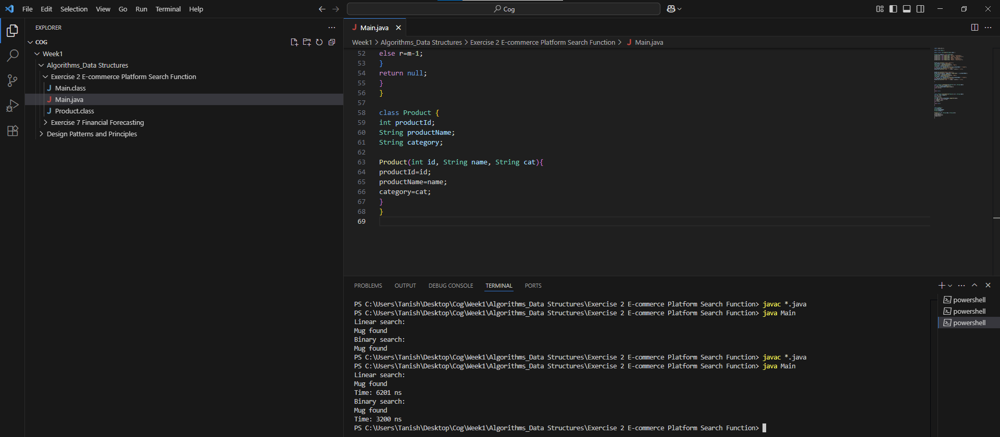

**Big O notation**

**Explain Big O notation and how it helps in analyzing algorithms?**

Big O notation is used to describe the performance or complexity of an algorithm with respect to input ‘n’.

It doesn’t give the exact time.

But it gives an idea of how fast or slow the algorithm becomes as input ‘n’ increases.

Hence can be used for comparing algorithms to choose the best one for our use case.

**Describe the best, average, and worst-case scenarios for search operations?**

**Three Scenarios in Big O :**

**Best Case:** Describes the case in which the algorithm completes in the shortest possible time. (Example, first element to find in linear search.)

**Average Case:** Describes the case in which the algorithm gets any random input. (Example, random element to find in linear search.)

**Worst Case:** Describes the case in which the algorithm completes in the longest possible time. (Example, last element to find in linear search.)

**Compare the time complexity of linear and binary search algorithms?**

**Linear Search vs Binary Search**

|**Algorithm**|**Best Case**|**Average Case**|**Worst Case**|
| :- | :- | :- | :- |
|**Linear Search**|O(1)|O(n)|O(n)|
|**Binary Search**|O(1)|O(log n)|O(log n)|

**Discuss which algorithm is more suitable for your platform and why.**

For a system or platform like an e-commerce store, we need to be able to quickly generate the search results for the customers or even access the relevant product in the database to recommend to the customers. Therefore, it is crucial to choose a faster yet reliable searching algorithm. Binary search makes for a good choice, since it shows its performance boost as the number of entities increase, and that is what happens over the time in a platform like this.

Being that said, it is recommended that we implement an even complex system like Hash Tables for an e-commerce platform to ensure a smooth experience to the users.

