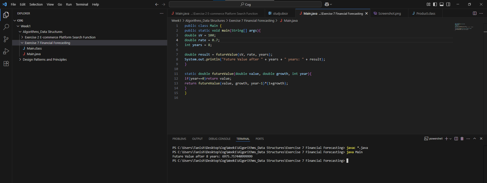

**Explain the concept of recursion and how it can simplify certain problems?**

Recursion is when a function calls itself.

It solves smaller versions of the same problem. 

It helps simplify problems that can be broken down into smaller sub-problems.

Famous Recursion Problems: Factorial, Fibonacci, Sum of N natural numbers.

**Discuss the time complexity of your recursive algorithm?**

The time complexity of the recursive algorithm is **O(n)**, because each year calls the previous year recursively until year 0.

**Explain how to optimize the recursive solution to avoid excessive computation?**

Usage of memoization helps recursion to avoid excessive computation by eliminating the need for recomputing the same values again and again.

In other words, Memoization is an optimization technique where results of previous function calls are stored so that when we need the same result again, we don't recompute it. Thus, saving computation time in recursion problems.

